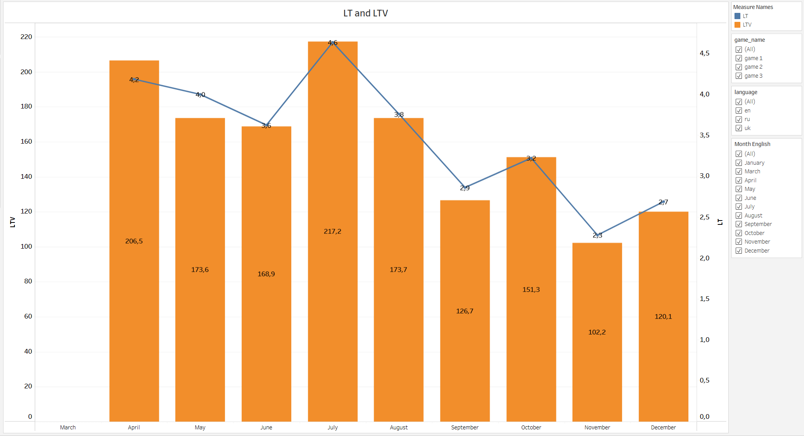
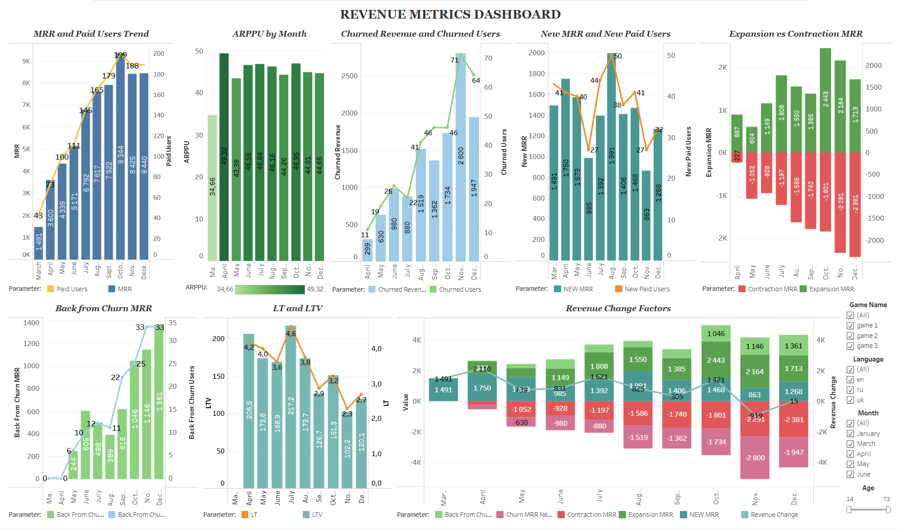

# Revenue Metrics Analysis

Revenue Metrics Analysis using SQL and Tableau

--- 

## Project Overview
This project analyzes subscription-based revenue using SQL and Tableau.
The goal is to understand revenue dynamics, user behavior, and key drivers of growth and decline.
The dataset contains user payments, allowing tracking of monthly revenue, user retention, and churn.
The dashboard now includes an Age filter, allowing users to analyze revenue metrics by customer age groups.

--- 

## Project Status

Current status: Dashboard v1 completed and published on Tableau Public.

Completed:
- Updated the SQL query and refreshed the CSV dataset;
- Rebuilt the main Tableau visualizations using the updated data;
- Added charts for MRR, Paid Users, ARPPU, New MRR, Churn, Expansion and Contraction MRR, Back from Churn MRR, LT, LTV, and Revenue Change Factors;
- Added interactive filters for Game Name, Language, Month, and Age;
- Standardized month labels in English across the Tableau dashboard;
- Refined the final Tableau dashboard formatting and applied a consistent color palette across the main charts.

--- 

## Live Dashboard

The final version of the interactive Revenue Metrics Dashboard is available on Tableau Public.

[Open the interactive Tableau dashboard](https://public.tableau.com/views/Project2_Revenuemetricsanalysis_/Dashboard1?:language=en-US&:sid=&:redirect=auth&:display_count=n&:origin=viz_share_link)

Current version: Dashboard v1 completed.

The dashboard uses a consistent color logic to make revenue growth, churn, contraction, returned users, and user-based metrics easier to distinguish.


--- 

##  Business Problem 

**The main objective is to identify:**
- What drives revenue growth?
- How user behavior affects revenue stability?
- Where the business loses money (churn)?

This analysis helps product managers make data-driven decisions.

--- 

##  SQL Analysis

The analysis is based on monthly aggregated user revenue.

**Key steps:**
1. Aggregated revenue per user per month;
2. Used window functions (LAG, LEAD) to track user behavior;
3. Calculated key metrics:
  - MRR (Monthly Recurring Revenue);
  - Paid Users;
  - ARPPU;
  - New Paid Users;
  - New MRR;
  - Churned Users;
  - Churned Revenue;
  - Churn Rate;
  - Revenue Churn Rate;
  - Expansion MRR;
  - Contraction MRR;
  - Back from Churn Users;
  - Back from Churn MRR;
  - Net MRR Growth / Revenue Change;
  - LT;
  - LTV.
  

**Example SQL snippet:**

```  
WITH monthly_revenue AS (
    SELECT
        DATE_TRUNC('month', gp.payment_date)::date AS payment_month,
        gp.user_id,
        gp.game_name,
        SUM(gp.revenue_amount_usd) AS total_revenue
    FROM project.games_payments gp
    GROUP BY 1, 2, 3
),

user_activity AS (
    SELECT
        mr.payment_month,
        mr.user_id,
        mr.game_name,
        mr.total_revenue,
        (mr.payment_month - INTERVAL '1 month')::date AS previous_calendar_month,
        (mr.payment_month + INTERVAL '1 month')::date AS next_calendar_month,
        LAG(mr.payment_month) OVER (
            PARTITION BY mr.user_id
            ORDER BY mr.payment_month
        ) AS previous_paid_month,
        LEAD(mr.payment_month) OVER (
            PARTITION BY mr.user_id
            ORDER BY mr.payment_month
        ) AS next_paid_month,
        LAG(mr.total_revenue) OVER (
            PARTITION BY mr.user_id
            ORDER BY mr.payment_month
        ) AS previous_paid_month_revenue
    FROM monthly_revenue mr
),
```
--- 

## Logic Highlights

- New users are identified as users with no previous payment history;
- Churn is assigned to the next calendar month if the user does not return;
- Expansion/Contraction is calculated only for consecutive months;
- Window functions are used to track previous and next payments.

--- 

## Dashboard Structure

The final Tableau dashboard includes the following visualizations:

- MRR and Paid Users Trend;
- ARPPU by Month;
- Churned Revenue and Churned Users;
- New MRR and New Paid Users;
- Expansion vs Contraction MRR;
- Back from Churn MRR and Users;
- LT and LTV;
- Revenue Change Factors.

Interactive filters:

- Game Name;
- Language;
- Month;
- Age.

This structure allows users to analyze subscription revenue dynamics, user growth, churn, returning users, and long-term customer value in one dashboard.
  
--- 

## Repository Structure

```text
revenue-metrics-analysis
│
├── README.md
│
├── data
│   └── revenue_metrics_dataset.csv
│
├── docs
│   ├── dashboard_design_notes.md
│   ├── dashboard_rebuild_notes.md
│   └── metric_definitions.md
│
├── images
│   ├── arppu_by_month.png
│   ├── back_from_churn_mrr.png
│   ├── churned_revenue_churned_users.png
│   ├── expansion_vs_contraction_mrr.png
│   ├── lt_and_ltv.png
│   ├── mrr_paid_users_trend.png
│   ├── new_mrr_new_paid_users.png
│   ├── revenue_change_factors_preview.png
│   └── revenue_metrics_dashboard_final.png
│
└── sql
    └── revenue_metrics.sql
```


## Dashboard Progress

### MRR and Paid Users Trend

This chart shows monthly MRR as bars and Paid Users as a line.  
It helps compare revenue growth with the number of paying users over time.


### ARPPU by Month

This chart shows the average revenue per paid user by month.  
ARPPU was calculated as `SUM(mrr) / SUM(paid_users)` to avoid incorrectly summing an average metric.


### New MRR and New Paid Users

This dual-axis chart shows monthly New MRR as bars and New Paid Users as a line.

It helps compare the revenue generated by newly acquired paying users with changes in the number of new paid users.


### Churned Revenue and Churned Users

This dual-axis chart shows monthly churned revenue as bars and churned users as a line.
It helps compare how much revenue was lost due to churn and how many users stopped paying over time.

The first month was excluded from the chart because churn requires a previous month for comparison.


### Expansion vs Contraction MRR

This chart compares Expansion MRR and Contraction MRR by month.

Expansion MRR shows additional revenue from existing users who increased their payments compared to the previous month.
Contraction MRR shows revenue decrease from existing users who paid less than in the previous month.

The chart helps evaluate whether revenue growth from existing users is stronger than revenue loss from reduced payments.


### Back from Churn MRR

This dual-axis chart shows revenue and users who returned after churn.

Bars represent Back from Churn MRR, which is revenue from users who stopped paying and later returned.
The line represents the number of users who returned after churn.

This chart helps understand how much recovered revenue comes from previously churned users.


### LT and LTV

This chart shows Customer Lifetime and Customer Lifetime Value by month.

LTV is shown as bars and represents the estimated revenue generated by an average paying user during their lifetime.
LT is shown as a line and represents the estimated average customer lifetime in months.

The chart helps evaluate how changes in customer lifetime affect long-term user value.




### Revenue Change Factors

This chart shows the main factors that influence monthly revenue change.

Positive revenue factors include New MRR, Expansion MRR, and Back from Churn MRR.
Negative revenue factors include Churned Revenue and Contraction MRR.

The chart uses a categorical color legend to clearly separate each revenue factor.
The line shows the overall Revenue Change by month.

Current status: completed and included in the final Tableau dashboard.

.

--- 

## Dashboard Preview

The final dashboard combines the main subscription revenue metrics into one interactive Tableau view.  
It helps analyze monthly MRR, paid users, ARPPU, churn, expansion, contraction, returning users, LT, LTV, and overall revenue change factors.

The dashboard uses a consistent color logic to separate revenue growth, revenue loss, churn, and user-based metrics.



---

## Key Insights

- MRR increased during the observed period, showing positive subscription revenue growth.
- Revenue growth was mainly supported by New MRR, Expansion MRR, and users returning after churn.
- Churned Revenue and Contraction MRR had a negative impact on monthly revenue dynamics.
- ARPPU remained relatively stable, which suggests that changes in revenue were mainly driven by user volume, retention, churn, and expansion behavior.
- Back from Churn MRR helped recover part of the lost revenue from previously churned users.
- LT and LTV provide additional context for evaluating the long-term value of paying users.


