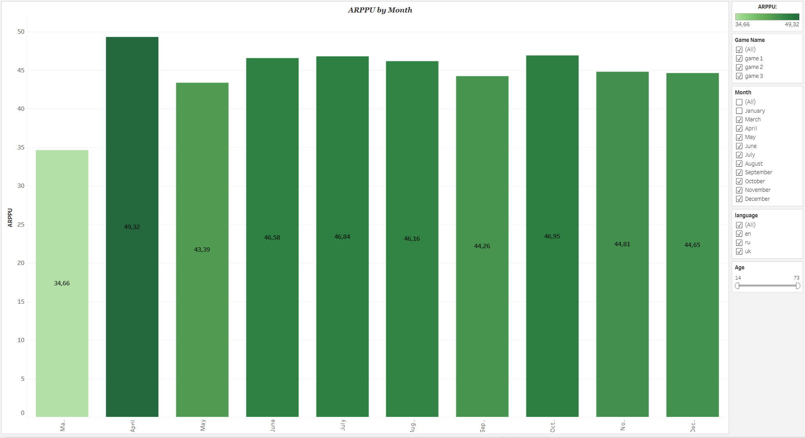
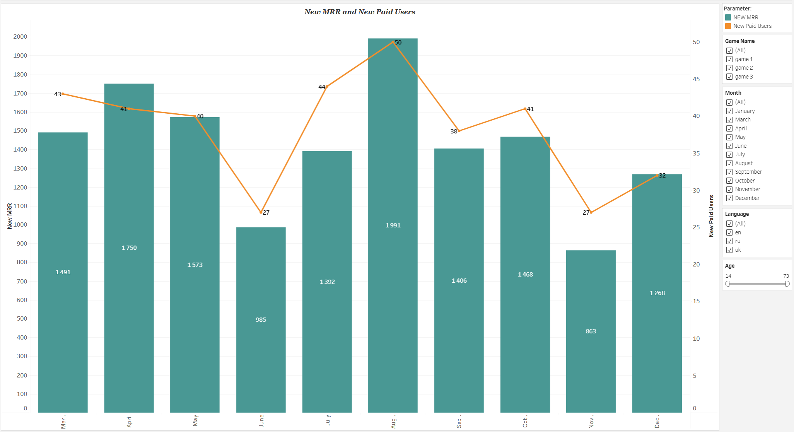
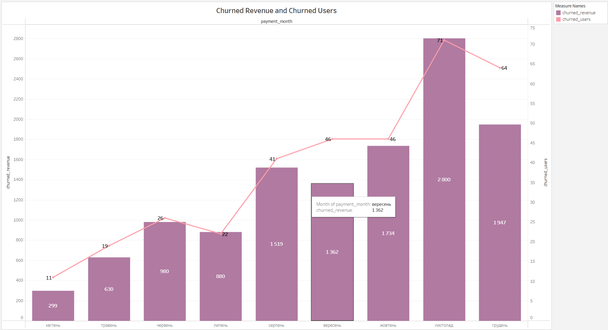
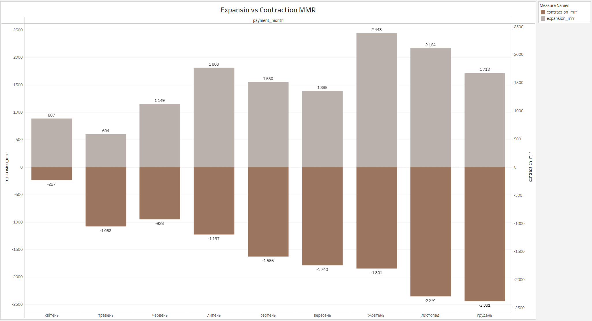
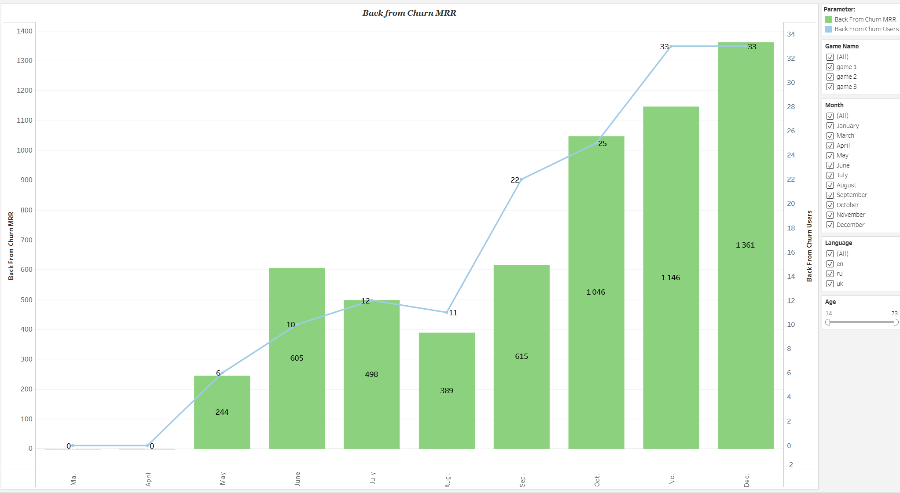
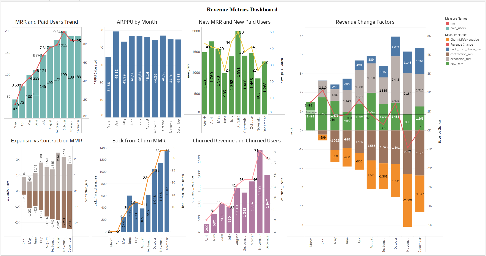
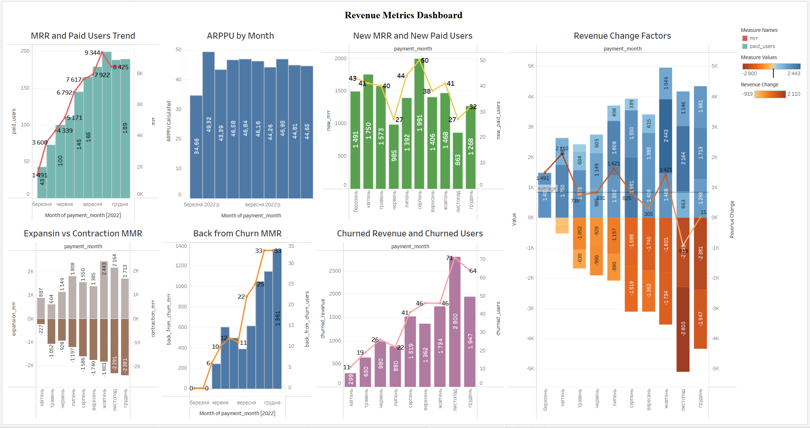

# Revenue Metrics Analysis

Revenue Metrics Analysis using SQL and Tableau

--- 

## Project Overview
This project analyzes subscription-based revenue using SQL and Tableau.
The goal is to understand revenue dynamics, user behavior, and key drivers of growth and decline.
The dataset contains user payments, allowing tracking of monthly revenue, user retention, and churn.

--- 

## Live Dashboard

The first version of the interactive Revenue Metrics Dashboard is available on Tableau Public.

[Open the interactive Tableau dashboard](https://public.tableau.com/views/Project2_Revenuemetricsanalysis_/Dashboard1?:language=en-US&:sid=&:redirect=auth&:display_count=n&:origin=viz_share_link)

Current version: Dashboard v1.
Chart formatting, dashboard layout, and final metric validation are still in progress.


--- 

##  Business Problem 

**The main objective is to identify:**
- What drives revenue growth?
- How user behavior affects revenue stability?
- Where the business loses money (churn)?

This analysis helps product managers make data-driven decisions.

--- 

##  SQL Analysis

The analysis is based on monthly aggregated user revenue.

**Key steps:**
1. Aggregated revenue per user per month;
2. Used window functions (LAG, LEAD) to track user behavior;
3. Calculated key metrics:
    - MRR (Monthly Recurring Revenue);
    - Paid Users;
    - ARPPU;
    - New Paid Users;
    - New MRR;
    - Churned Users;
    - Churned Revenue;
    - Churn Rate;
    - Revenue Churn Rate;
    - Expansion MRR;
    - Contraction MRR.

  

**Example SQL snippet:**

```  
WITH monthly_revenue AS (
    SELECT
        DATE_TRUNC('month', gp.payment_date)::date AS payment_month,
        gp.user_id,
        gp.game_name,
        SUM(gp.revenue_amount_usd) AS total_revenue
    FROM project.games_payments gp
    GROUP BY 1, 2, 3
),

user_activity AS (
    SELECT
        mr.payment_month,
        mr.user_id,
        mr.game_name,
        mr.total_revenue,
        (mr.payment_month - INTERVAL '1 month')::date AS previous_calendar_month,
        (mr.payment_month + INTERVAL '1 month')::date AS next_calendar_month,
        LAG(mr.payment_month) OVER (
            PARTITION BY mr.user_id
            ORDER BY mr.payment_month
        ) AS previous_paid_month,
        LEAD(mr.payment_month) OVER (
            PARTITION BY mr.user_id
            ORDER BY mr.payment_month
        ) AS next_paid_month,
        LAG(mr.total_revenue) OVER (
            PARTITION BY mr.user_id
            ORDER BY mr.payment_month
        ) AS previous_paid_month_revenue
    FROM monthly_revenue mr
),
```
--- 

## Logic Highlights

- New users are identified as users with no previous payment history;
- Churn is assigned to the next calendar month if the user does not return;
- Expansion/Contraction is calculated only for consecutive months;
- Window functions are used to track previous and next payments.

--- 

## Dashboard Plan

**The dashboard will include:**

- KPI section (MRR, Users, ARPPU, Churn Rate);
- Revenue trend over time;
- User growth and decline;
- Revenue breakdown (New, Expansion, Contraction, Churn);
- User flow (New vs Churned users);
- Churn rate trend.

**Filters:**
- Language;
- Age;
- Device type;
- Game name.

--- 

## Repository Structure

```

revenue-metrics-analysis
│
├── README.md
│
├── data
│   └── revenue metrics dataset files
│
├── docs
│   └── project notes and metric documentation
│
├── images
│   └── dashboard screenshots and chart previews
│
└── sql
    └── revenue_metrics.sql
```

## Dashboard Progress

### MRR and Paid Users Trend

This chart shows monthly MRR as bars and Paid Users as a line.  
It helps compare revenue growth with the number of paying users over time.


### ARPPU by Month

This chart shows the average revenue per paid user by month.  
ARPPU was calculated as `SUM(mrr) / SUM(paid_users)` to avoid incorrectly summing an average metric.




### New MRR and New Paid Users

This dual-axis chart shows monthly New MRR as bars and New Paid Users as a line.

It helps compare the revenue generated by newly acquired paying users with changes in the number of new paid users.




### Churned Revenue and Churned Users

This dual-axis chart shows monthly churned revenue as bars and churned users as a line.
It helps compare how much revenue was lost due to churn and how many users stopped paying over time.

The first month was excluded from the chart because churn requires a previous month for comparison.




### Expansion vs Contraction MRR

This chart compares Expansion MRR and Contraction MRR by month.

Expansion MRR shows additional revenue from existing users who increased their payments compared to the previous month.
Contraction MRR shows revenue decrease from existing users who paid less than in the previous month.

The chart helps evaluate whether revenue growth from existing users is stronger than revenue loss from reduced payments.




### Back from Churn MRR

This dual-axis chart shows revenue and users who returned after churn.

Bars represent Back from Churn MRR, which is revenue from users who stopped paying and later returned.
The line represents the number of users who returned after churn.

This chart helps understand how much recovered revenue comes from previously churned users.



### Revenue Change Factors

This chart shows the main factors that influence monthly revenue change.

Positive revenue factors include New MRR, Expansion MRR, and Back from Churn MRR.
Negative revenue factors include Churned Revenue and Contraction MRR.

The chart uses a categorical color legend to clearly separate each revenue factor.
The line shows the overall Revenue Change by month.

Current status: visualization improved; final dashboard formatting is still in progress.

.

## Dashboard Rebuild Update

The revenue metrics dataset was refreshed after updating the SQL query.  
A new Tableau dashboard version was created and previous charts were rebuilt using the updated CSV dataset.

The Back from Churn MRR chart was also recreated with the refreshed data.  
The Revenue Change Factors visualization has been added as a draft and will be refined before the final dashboard is published.

## Dashboard Preview

The first version of the Revenue Metrics Dashboard has been assembled in Tableau.

This draft combines the main revenue, user, churn, and revenue change visualizations. The layout and formatting will be refined before the final dashboard is published.




